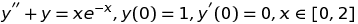
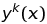

# Лабораторная работа №7. Задача Коши.
Выполнил студент группы 427
Плотников Леонид Михайлович
#Вариант №3
Решить методом Тейлора 2-го порядка задачу Коши

с заданной отномительной точностью 0,01.
Требуется построение графиков решения y(x), y'(x), а также фазовых траекторий.
# Теоретическая часть
Метод разложения в ряд Тейлора.
Простейшим способом построения приближенного решения в точке 
 сетки 
 является способ, основанный на разложении решения в ряд Тейлора в предыдущеё точке сетки 
 по степеням шага h:

Взяв вместо этого ряда конечный его отрезок
 и заменяя в нём производные
 в силу дифференциального уравнения
 получаем последовательность приближений

При p=2 получаем схему

Для систем ДУ вида 
 метод тождественнен в векторной записи скалярной

# Практическая часть
MMM7.cpp
Функции z1 и z2 возвращают часто используемые выражения, Taylor1 и Taylor2- итерационные выражения для y1, y2 соответственно, Toch1 и Toch2- возвращают точные решения для y, y'.
В main сам итерационный процесс, проверка на погрешность и, наконец, запись значений в файл.
graph.py
Строит графики y(x), y'(x), y'(y), точные решения для y, y'.
# Результаты
В результате работы программы получили решение задачи Коши для заданного уравнения с заданной точностью. Итерационное решение почти не отличается от точного.
